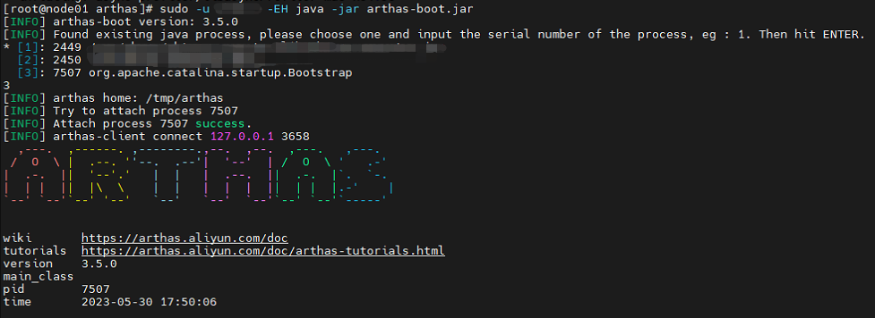
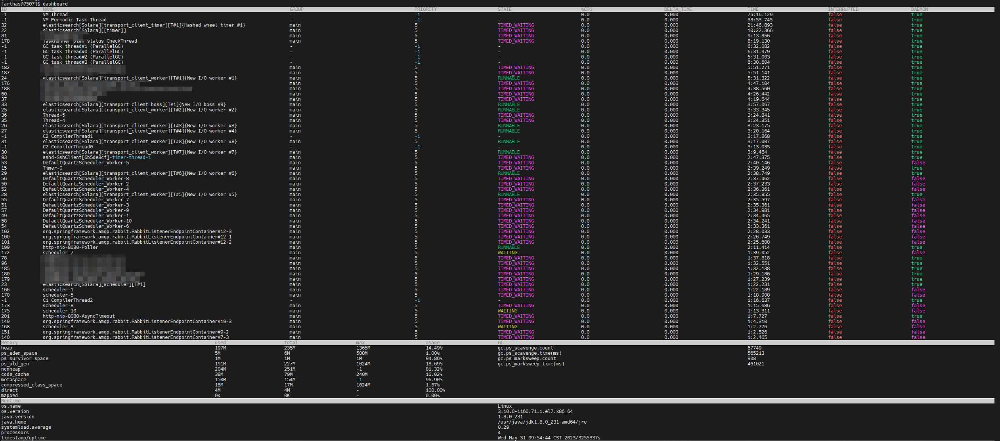

# 一、简介

## 1.1 什么是 Arthas

Arthas 是一款线上监控诊断产品，通过全局视角实时查看应用 load、内存、gc、线程的状态信息，并能在不修改应用代码的情况下，对业务问题进行诊断，包括查看方法调用的出入参、异常，监测方法执行耗时，类加载信息等，大大提升线上问题排查效率。

## 1.2 下载 Arthas

下载地址：https://arthas.aliyun.com/download/latest_version?mirror=aliyun

## 1.3 启动方式

将下载的文件解压后，可以看到有 `as.sh`和 `arthas-boot.jar`，有两种启动方式

- 直接执行 `./as.sh`启动
- 执行 `java -jar arthas-boot.jar`启动

> 需要注意的是：使用和目标进程一致的用户启动，否则可能 attach 失败
>
> - 执行该程序的用户需要和目标进程具有相同的权限。比如以 `admin`用户来执行：`sudo su admin && java -jar arthas-boot.jar`或 `sudo -u admin -EH java -jar arthas-boot.jar`。
> - 如果 attach 不上目标进程，可以查看`~/logs/arthas/`目录下的日志。

执行成功后会显示 Java 进程信息，输入对应的数字序号后回车，Arthas 会 attach 到目标进程上，并输出日志。

##### 

# 二、命令列表及其使用

## 2.1 JVM 相关

### 2.1.1 dashboard - 当前系统的实时数据面板

#### 2.1.1.1 作用

显示当前系统的实时数据面板，按 `ctrl+c`退出。

#### 2.1.1.2 参数说明

| **参数名称** |               **参数说明**               |
| :----------: | :--------------------------------------: |
|     [i:]     | 刷新实时数据的时间间隔 (ms)，默认 5000ms |
|     [n:]     |            刷新实时数据的次数            |

实例：`dashboard -i 1000 -n 2` ：每1000ms刷新一次，刷新两次。

#### 2.1.1.3 数据说明



- ID: Java 级别的线程 ID，注意这个 ID 不能跟 jstack 中的 nativeID 一一对应。
- NAME: 线程名
- GROUP: 线程组名
- PRIORITY: 线程优先级, 1~10 之间的数字，越大表示优先级越高
- STATE: 线程的状态
- CPU%: 线程的 cpu 使用率。比如采样间隔 1000ms，某个线程的增量 cpu 时间为 100ms，则 cpu 使用率=100/1000=10%
- DELTA_TIME: 上次采样之后线程运行增量 CPU 时间，数据格式为秒
- TIME: 线程运行总 CPU 时间，数据格式为分:秒
- INTERRUPTED: 线程当前的中断位状态
- DAEMON: 是否是 daemon 线程

从上图中可以看到有些线程的 ID、PRIORITY 为-1，且没有状态等属性，这是因为这些线程是 JVM 内部线程。

#### 2.1.1.4 JVM 内部线程

Java 8 之后支持获取 JVM 内部线程 CPU 时间，这些线程只有名称和 CPU 时间，没有 ID 及状态等信息（显示 ID 为-1）。 通过内部线程可以观测到 JVM 活动，如 GC、JIT 编译等占用 CPU 情况，方便了解 JVM 整体运行状况。

- 当 JVM 堆(heap)/元数据(metaspace)空间不足或 OOM 时，可以看到 GC 线程的 CPU 占用率明显高于其他的线程。
- 当执行 `trace/watch/tt/redefine`等命令后，可以看到 JIT 线程活动变得更频繁。因为 JVM 热更新 class 字节码时清除了此 class 相关的 JIT 编译结果，需要重新编译。

JVM 内部线程包括下面几种：

- JIT 编译线程: 如 `C2 CompilerThread0`, `C1 CompilerThread2`
- GC 线程: 如 `GC Thread0`, `G1 Young RemSet Sampling`
- 其它内部线程: 如 `VM Periodic Task Thread`, `VM Thread`, `Service Thread`

### 2.1.2 ognl - 执行 ognl 表达式

#### 2.1.2.1 作用

执行 ognl 表达式

#### 2.1.2.2 参数说明

|    **参数名称**     |                         **参数说明**                         |
| :-----------------: | :----------------------------------------------------------: |
|      *express*      |                         执行的表达式                         |
|        [c:]         | 执行表达式的 ClassLoader 的 hashcode，默认值是 SystemClassLoader |
| [classLoaderClass:] |          指定执行表达式的 ClassLoader 的 class name          |
|         [x]         |                 结果对象的展开层次，默认值 1                 |

#### 2.1.2.3 ognl 表达式说明

##### 2.1.2.3.1 语法

基本的 OGNL 表达式非常简单。该语言的特性已经变得非常丰富，但是您通常不需要担心该语言中更复杂的部分：简单的情况仍然如此。例如，要获取对象的 name 属性，OGNL 表达式就是 `name`。要获取由 headline 属性返回的对象的 text 属性，OGNL 表达式是 `headline.text`。

OGNL 表达式的基本单元是导航链，通常简称为“链”。最简单的链条由以下部分组成：

| **表达式元素部分** |                      **例子**                       |
| :----------------: | :-------------------------------------------------: |
|      属性名称      |     比如上面示例中的 `name`和 `headline.text`。     |
|      方法调用      |          `hashCode()`返回当前对象的哈希码           |
|      数组索引      | `listeners[0]`返回当前对象 listeners 列表中的第一个 |

所有 OGNL 表达式都在当前对象的上下文中求值，而链只是使用链中前一个链接的结果作为下一个链接的当前对象。你想把链条拉长多长都行。例如，这条链：

```
name.toCharArray()[0].numericValue.toString()
```

这个表达式按照以下步骤进行计算：

1. 提取初始或根对象（用户通过 OGNL 上下文提供给 OGNL ）的 name 属性；
2. 在结果字符串上调用 toCharArray() 方法；
3. 从结果数组中提取第一个字符（索引为0的字符）；
4. 从该字符获取 numericValue 属性(字符表示为 `Character`对象，`Character`类有一个名为 getNumericValue() 的方法)。
5. 在结果 Integer 对象上调用 toString()。这个表达式的最终结果是最后一次 toString() 调用返回的 String。

请注意，这个示例只能用于从对象获取值，而不能用于设置值。将上述表达式传递给 Ognl.setValue() 方法将导致InappropriateExpressionException被抛出，因为链中的最后一个链接既不是属性名也不是数组索引。

##### 2.1.2.3.2 表达式

本节概述了 OGNL 表达式元素的细节。

**常量**

OGNL 有以下几种常量：

- String 字面值，如 Java 中由单引号或双引号分隔，并带有完整的转义集；
- Character 字面量，也与 Java 一样：由单引号分隔，也带有全套转义；
- 数字字面值，比 Java 多一些类型。除了 Java 的整型、长型、浮点数和双精度外，OGNL 还允许您指定带有“b”或“b”后缀的 BigDecimals，以及带有“h”或“h”后缀的 BigIntegers(想想“huge”——我们选择了“h”表示)；
- Boolean：true 或者 false；
- null

**引用属性**

OGNL 在处理属性引用时以不同的方式对待不同类型的对象。映射将所有属性引用视为元素查找或存储，并将属性名称作为键。列表和数组类似地处理数字属性，以属性名作为索引，但处理字符串属性的方式与普通对象相同。普通对象（即所有其他类型的对象）只能通过使用“get”和“set”方法（或“is”和“set”）处理字符串属性，如果对象有这些方法，或者使用给定名称的字段处理字符串属性。

注意这里的新术语。属性“名称”可以是任何类型，而不仅仅是字符串。但是要引用非字符串属性，必须使用我们一直称为“索引”的符号。例如，要获取一个数组的长度，你可以使用这个表达式：

```
array.length
```

但是要获取数组的元素0，你必须使用这样的表达式：

```
array[0]
```

**索引**

如上所述，“索引”表示法实际上只是属性引用，尽管是一种计算形式的属性引用，而不是常数形式。
例如，OGNL在内部处理 `array.length`表达式与这个表达式完全相同：

```
array["length"]
```

这个表达式会有相同的结果（尽管内部形式不同）：

```
array["len" + "gth"]
```

### 2.1.3 getstatic - 查看类的静态属性

### 2.1.4 heapdump - dump java heap, 类似 jmap 命令的 heap dump 功能

### 2.1.5 jvm - 查看当前 JVM 的信息

### 2.1.6 logger - 查看和修改 logger

### 2.1.7 mbean - 查看 Mbean 的信息

### 2.1.8 memory - 查看 JVM 的内存信息

### 2.1.9 perfcounter - 查看当前 JVM 的 Perf Counter 信息

### 2.1.10 sysenv - 查看 JVM 的环境变量

### 2.1.11 sysprop - 查看和修改 JVM 的系统属性

### 2.1.12 thread - 查看当前 JVM 的线程堆栈信息

### 2.1.13 vmoption - 查看和修改 JVM 里诊断相关的 option

### 2.1.14 vmtool - 从 jvm 里查询对象
