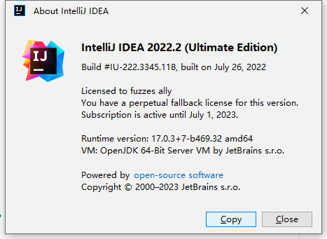
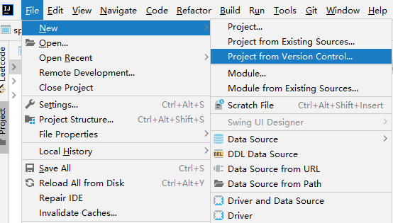
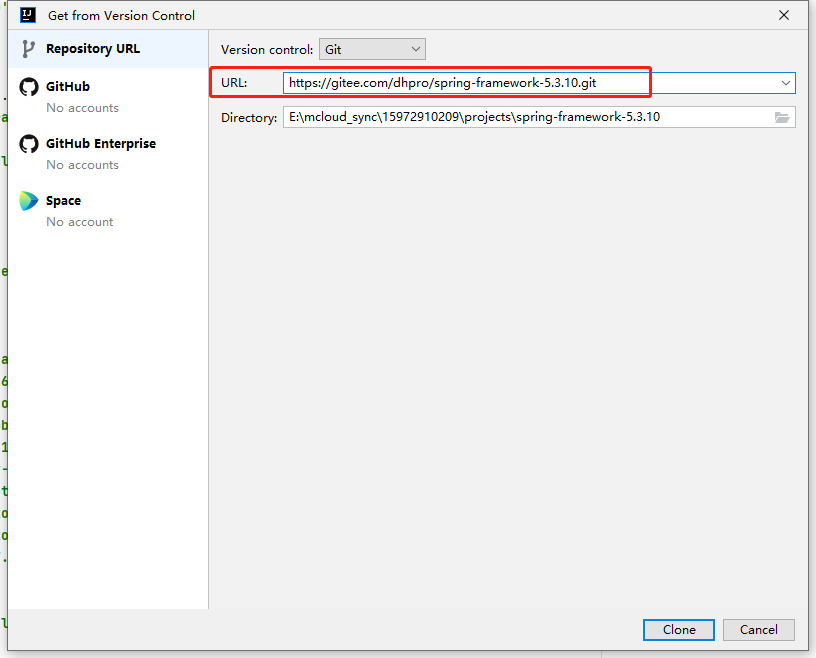
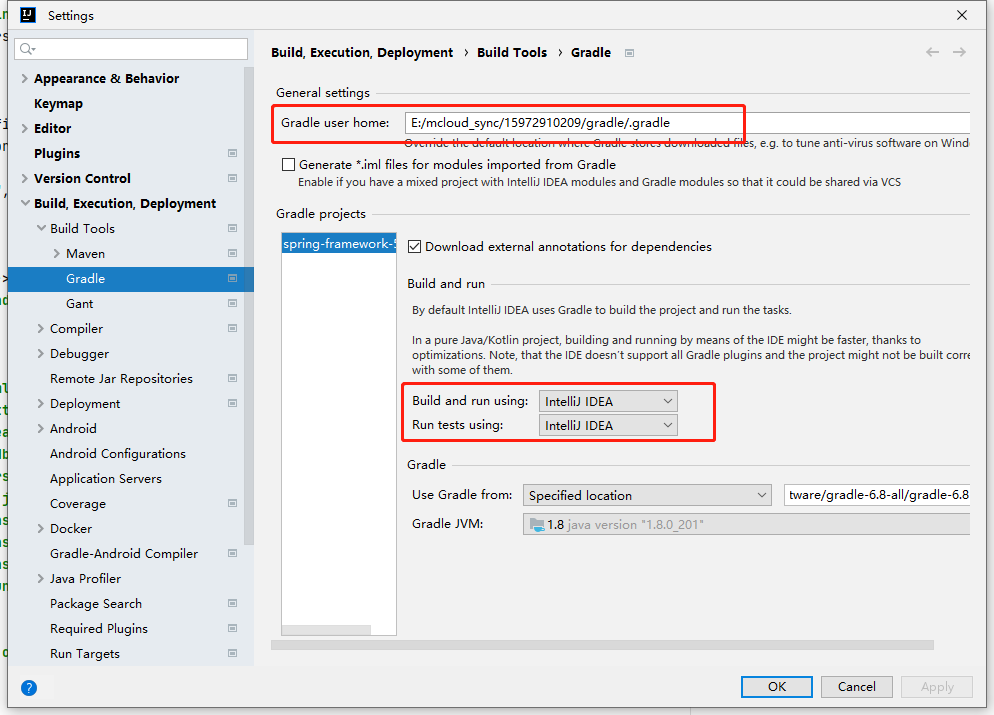
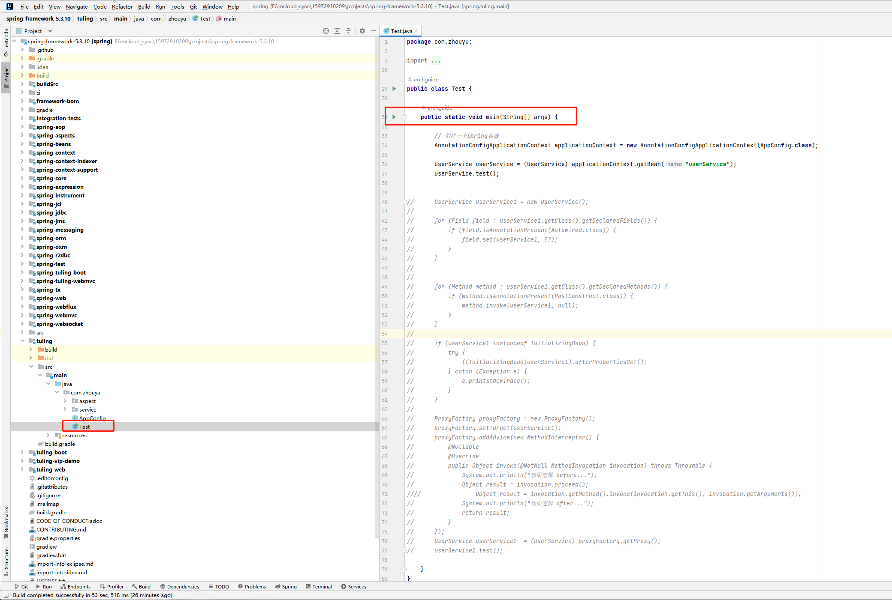
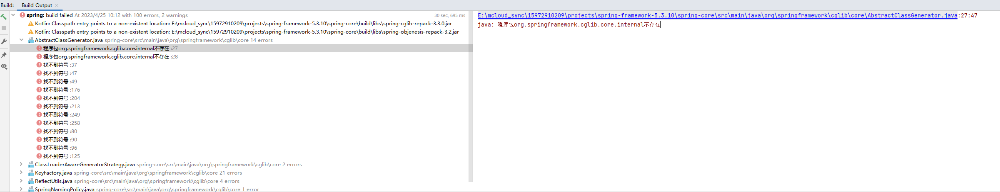
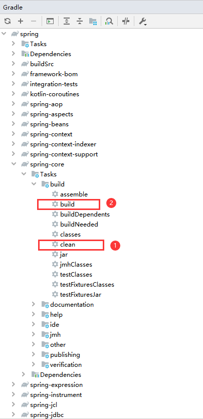
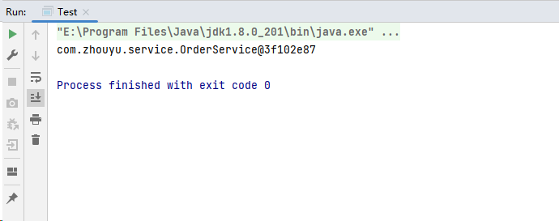

> 此教程是基于周瑜老师的 **Spring5.3.10 注释版源码**编译的，并不是 Github 原生的 Spring5.3.10 源码，有一些差别，但都是 gradle 配置文件的微小改动，比如把某些依赖从 optional 改成 compile 级别、修改了 gradle 仓库的地址（主要是为了方便编译），其他都没改动。

# 一、版本

- Spring 版本：5.3.10
- Gradle 版本：6.8
- IDEA 版本：2022.2

# 二、下载Spring源码所需要的依赖

因为Spring源码存在很多依赖包，如果自行下载，会需要下很久，所以此处将我自己电脑上已下载的依赖给出：

> 链接：https://caiyun.139.com/m/i?005CiN4dFp6mN
>
> 提取码：TbOy

# 三、下载 Spring 源码

git clone 的地址为：https://gitee.com/dhpro/spring-framework-5.3.10.git

建议直接用 IDEA 的 git 来下载源码：

输入地址，点击 Clone，就会开始下载源码工程（因为是从 gitee 上下载，所以会比从 github 上下载快很多)。 一旦下载完成，IDEA 就会自动下载 gradle，下载完 gradle 就会开始下载 Spring 源码依赖，但是我们已经有现成的了，所以可以直接取消这个过程。

# 四、修改IDEA的gradle配置

首先把 gradle user home 改为 **.gradle压缩包** 的解压之后的文件路径，

然后把 Build and run using 和 Run tests using 都改为 IntelliJ IDEA，

改完之后点击 Apply，再点击 OK，会自动触发 gradle 的重新编译。

# 五、运行代码

编译成功后，在左侧可以看到如下模块，其中有一个 tuling 模块，这是一个可以直接运行的模块，在它下面有一个 Test 类，直接运行 main 方法。

## 5.1 运行过程中可能出现的问题

### 5.1.1 问题一

我在运行的时候出现了以下错误：

由于报错的是 core 模块，所以在 gradle 中找到 core 模块，先执行 clean，然后 build，执行完毕后重新运行程序，问题解决。

