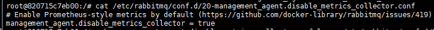

本文主要介绍使用 `docker-compose` 安装 `Redis`、`Elasticsearch`、`RabbitMQ`、`PostgreSQL` 这几个组件。

# 一、环境准备

首先需要安装 docker 并启动

```shell
yum install -y docker-ce
systemctl start docker
```

然后需要安装 docker-compose

可以去 github 上下载 docker-compose，将下载的二进制文件放在 `/usr/local/bin` 目录，然后修改文件权限

```shell
chmod 755 /usr/local/bin/docker-compose
```

然后输入 `docker-compose -v` 验证

# 二、拉取镜像

此处使用的几个组件版本分别为：

- ElasticSearch：2.4.6
- Redis：7.0.4
- RabbitMQ：latest
- PostgreSQL：9.6.21

ElasticSearch 、Redis、PostgreSQL 指定了版本号，RabbitMQ 未指定，使用了最新版本。

```shell
docker pull elasticsearch:2.4.6
docker pull redis:7.0.4
docker pull rabbitmq
docker pull postgres:9.6.21
```

# 三、编辑 docker-compose.yml

创建一个 `docker-compose.yml` 文件

```yaml
version: '3.9'
services:
  elasticsearch:
    image: elasticsearch:2.4.6
    container_name: es-2.4.6-ssl
    privileged: true
    #总是重启后启动
    #restart: always
    environment:
      - "cluster.name=es-dh" #设置集群名称为es-dh
      - "discovery.type=single-node" #以单一节点模式启动
      - "ES_JAVA_OPTS=-Xms128m -Xmx1024m" #设置使用jvm内存大小
      - bootstrap.memory_lock=true
    volumes:
      - /dh/volumes/es/es-2.4.6-ssl/plugins:/usr/share/elasticsearch/plugins #插件文件挂载
      - /dh/volumes/es/es-2.4.6-ssl/data:/usr/share/elasticsearch/data:rw #数据文件挂载
      - /dh/volumes/es/es-2.4.6-ssl/logs:/user/share/elasticsearch/logs:rw #日志文件挂载
      - /dh/volumes/es/es-2.4.6-ssl/elasticsearch.yml:/etc/elasticsearch/elasticsearch.yml #配置文件挂载
    ports:
      - 9200:9200
      - 9300:9300

  es-head:
    image: elasticsearch-head:5
    container_name: es-head-5
    ports:
      - 9100:9100
          

  rabbitmq:
    container_name: rabbitmq
    image: rabbitmq:latest
    privileged: true
    ports:
      - 5672:5672
      - 15672:15672
    volumes:
      - /dh/volumes/rabbitmq/:/var/lib/rabbitmq
      - /dh/volumes/rabbitmq/rabbitmq.ssl.config:/etc/rabbitmq/rabbitmq.config
    environment:
      - RABBITMQ_DEFAULT_VHOST=/
      - RABBITMQ_DEFAULT_USER=dh
      - RABBITMQ_DEFAULT_PASS=dh
          

  redis:
    image: redis:7.0.4
    container_name: redis-7.0.4-ssl
    privileged: true
    volumes:
      - /dh/volumes/redis/redis-7.0.4-ssl/data:/data
      - /dh/volumes/redis/redis-7.0.4-ssl:/var/lib/redis
      - /dh/volumes/redis/redis-7.0.4-ssl/redis.conf:/etc/redis/redis.conf
      #- /dh/volumes/redis/redis-7.0.4-ssl/logs/redis.log:/var/log/redis/redis.log
      - /var/lib/redis/server.crt:/var/lib/redis/server.crt
      - /var/lib/redis/server.key:/var/lib/redis/server.key
      - /var/lib/redis/ca.crt:/var/lib/redis/ca.crt
    command: ["redis-server","/etc/redis/redis.conf"]
    ports:
      - 6379:6379


  postgres:
    image: postgres:9.6.21
    privileged: true
    container_name: postgresql-9.6.21-ssl
    ports:
      - 5433:5432
    environment:
      POSTGRES_PASSWORD: postgres
      PGDATA: /var/lib/pgsql/9.6/data/
    volumes:
      - /dh/volumes/pgsql/pgsql-9.6.21-ssl/data:/var/lib/pgsql/9.6/data/
      - /dh/volumes/pgsql/server.crt:/var/lib/pgsql/server.crt
      - /dh/volumes/pgsql/server.key:/var/lib/pgsql/server.key
      - /dh/volumes/pgsql/ca.crt:/var/lib/pgsql/ca.crt
```

从上面可以看到我们挂载了一些文件和目录，对于挂载的文件，需要修改其权限为 777。

> 需要注意：对于 PostgreSQL需要特殊处理，我们将宿主机的 /dh/volumes/pgsql/pgsql-9.6.21-ssl/data 目录挂载到容器的 /var/lib/pgsql/9.6/data/ 目录，宿主机的这个目录必须是一个空目录，否则 PostgreSQL 会启动失败，如果我们想修改配置文件，可以等容器启动后再修改配置文件，然后重启 PostgreSQL。
>
> 由于我们给 PostgreSQL 开启了SSL并挂在了 证书文件，但是 PostgreSQL 的证书文件权限必须为 600 （database user）或 640（root），所以此处我们如果给这三个文件777的权限同样会启动失败，此时我们可以看看挂载的目录里的文件所属用户和所属组，使用chown将这三个证书文件的所属组和用户修改成一样的，并修改权限为600。

# 四、启动

执行 `docker-compose up -d` 启动该文件中定义的所有容器。

如果想删除所有容器，可以执行 `docker-compose down`

删除所有已停止的容器，`docker-compose rm --stop`

删除某个已停止的容器，`docker-compose rm --stop ${server_name}`

删除某个正在运行的容器， `docker-compose rm -f ${service_name}`

如果想单独创建某个容器，执行 `docker-compose up -d ${server_name}`

如果想单独启动或停止某个容器 ，执行 `docker-compose start/stop ${server_name}`


# 五、常见问题

## 5.1 开启 rabbitmq web管理端

进入容器，执行 `rabbitmq-plugins enable rabbitmq_management`

此时访问管理页面，点击 Channels 可能会报错，解决办法：

①查看配置文件

```shell
cat /etc/rabbitmq/conf.d/management_agent.disable_metrics_collector.conf
```

注意：文件名可能不是management_agent.disable_metrics_collector.conf，可能是xx-management_agent.disable_metrics_collector.conf，具体的可以看这个目录下面的实际文件名。



②将配置文件中的 `true` 修改成 `false`

```shell
echo management_agent.disable_metrics_collector = false > /etc/rabbitmq/conf.d/management_agent.disable_metrics_collector.conf
```

然后退出容器，重启 rabbitmq

